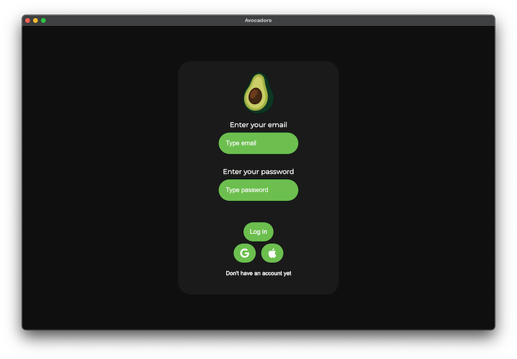
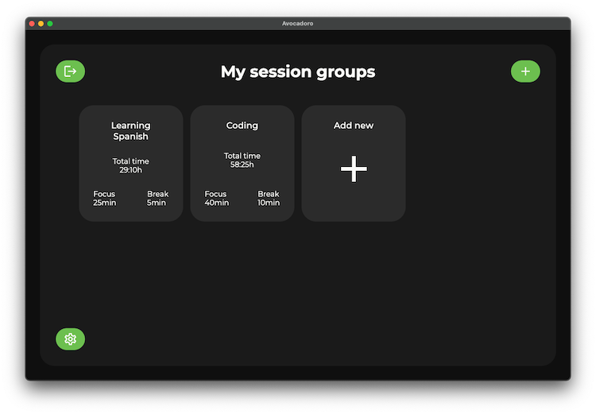
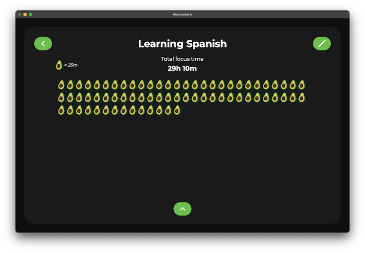
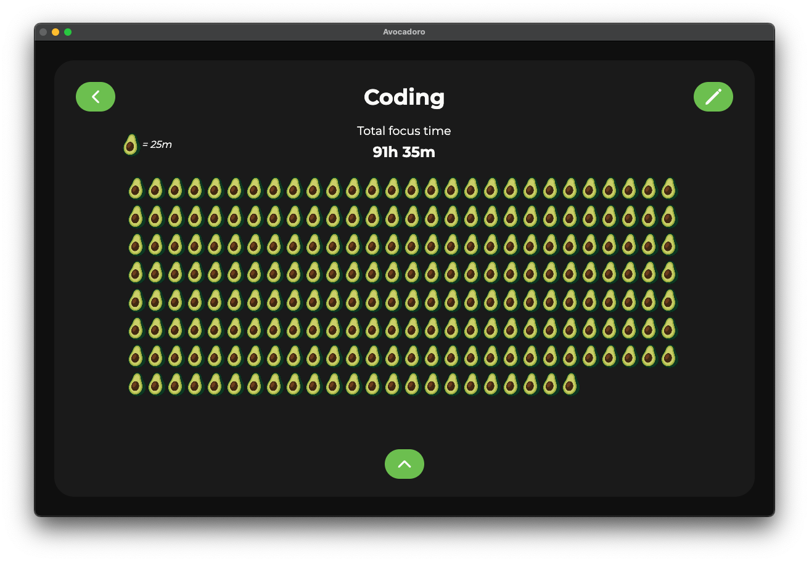

# 🥑 Avocadoro

**Avocadoro** is a Pomodoro-style productivity app built with **React**, **TypeScript**, **Electron**, and **Supabase**.  
It helps you focus on your study or learning sessions, track breaks, and visualize your progress over time.

<p align="center">
  
</p>
<p align="center">
  
</p>
<p align="center">
  
</p>
<p align="center">
  
</p>
<p align="center">
  
</p>

---

## 🔗 Quick Links

- [🚀 Features](#features)
- [🧩 Tech Stack](#tech-stack)
- [🛠️ Installation & Setup](#setup)
- [📖 How to Use](#how-to-use)
- [🧪 Testing & Building 📦](#testing--building)
- [🤝 Contributing](#contributing)

<a id="features"></a>

## 🚀 Features

- ⏱️ **Pomodoro Timer** — Focus and break intervals based on the Pomodoro technique.
- 📊 **Progress Tracking** — View total study time and completed sessions.
- 💾 **Data Persistence** — All session data stored securely in **Supabase**.
- 🖥️ **Cross-Platform App** — Built with **Electron** for desktop use.
- 🎯 **Custom Goals** — Choose your learning topic and track progress per category.

<a id="tech-stack"></a>

## 🧩 Tech Stack

- **Frontend:** React + TypeScript
- **Backend / Auth / DB:** Supabase
- **Desktop Wrapper:** Electron
- **Testing:** WebdriverIO (WDIO)

<a id="setup"></a>

## 🛠️ Installation & Setup

Follow these steps to get the project running locally:

### 1. Clone the repository

```bash
git clone [https://github.com/koleks92/Avocadoro.git](https://github.com/koleks92/Avocadoro.git)
cd Avocadoro
```

### 2. Install dependencies

```
npm install
```

### 3. Configure Environment Variables

Create a file named `.env.local` in the root directory and add your Supabase credentials:

```
VITE_SUPABASE_URL=your_supabase_url_here
VITE_SUPABASE_PUBLISHABLE_KEY=your_supabase_anon_key_here
```

### 4. Run the App

To start the application in development mode:

```
npm run start
```

<a id="how-to-use"></a>

## 📖 How to Use

### Getting Started (Authentication)

When you first launch Avocadoro, you will see the **Login Page**. You have three ways to access your account:

- **Email & Password:** Enter your credentials and click **Log In**.

- **Google Login:** Click the **Google Logo** and follow the browser instructions to sign in.

- **Apple Login:** Click the **Apple Logo** and follow the prompts to sign in with your Apple ID.

---

### Creating an Account

If you are a new user:

1.  Click the link: **"Don't have an account yet?"**

2.  Enter your **Email**, choose a **Password**, and **Confirm Password**.

3.  Click **Sign Up**.

4.  If the email is not already in the database, your account will be created and you will be **automatically logged in**.

---

### Navigating the Dashboard

Once logged in, the **Dashboard** is your main hub:

- **Logout:** Click the button in the **top-left corner** to sign out of your account.

- **New Session:** Click the button in the **top-right corner** or in the **middle of the screen** to create a new session group.

- **Settings:** Access app preferences via the button in the **bottom-left corner**.

- **Opening Sessions:** In the middle of the screen, you will see your created session groups. To open one, simply **click on the square box** containing the group's name.

---

### Creating a New Session Group

To add a new session group, click the button in the top-right corner and follow these steps:

1. **Session Name**: Enter a name for your group. If the name is already taken or unavailable, the app will notify you.

2. **Focus Time**: Select your focus duration between 5 and 60 minutes (available in 5-minute intervals).

3. **Break Time**: Select your break duration between 5 and 60 minutes (available in 5-minute intervals).

4. **Confirm**: Click Add to create the group and return to the dashboard.

---

### Editing an Existing Session Group

To **modify** a group you have already created:

1. Open Group: From the dashboard, click on the session group you wish to change.

2. Enter Edit Mode: Click the button in the top-right corner to open the edit screen.

3. Modify the session name, focus time, or break time and click Update.

To **delete** a group you have already created:

1. Open Group: From the dashboard, click on the session group you wish to change.

2. Enter Edit Mode: Click the button in the top-right corner to open the edit screen.

3. To delete the group entirely, click the button in the top-right corner and confirm by clicking the right button in the pop-up.

**Discard Changes**: To cancel any edits and return to the session view, click the Back ﹤ button in the top-left corner.

---

### Session View & Timer

To open a session group, click its name on the dashboard. This view contains the following:

**Navigation & Editing:**

- **Top-left:** Back button to return to the dashboard.

- **Top-right:** Edit button (see the Editing an Existing Session Group section).

**Timer Display**:

- **Center**: Displays the session name, current mode (Focus or Break), and the time remaining.
- **Motivational Quotes**: A section below the timer providing inspiration during your session.
- **Controls**:

    ▶ **Play**: Start the focus or break timer.

    ⏸ **Pause**: Temporarily pause the active timer.

    ♻︎ **Reset**: Double-click the reset button to return the timer to its initial state.

**Total Time & Visualization:**

- **Arrow Down**: Click this to hide the timer and open the Total Focus Time view.

- **Visualization**: This view shows a visual representation of your progress. A Legend in the top-left corner explains what each symbol represents in terms of time.

- **Arrow Up**: Click this to return to the active timer view.

<br>

**⚠️ Important Rules**

- **Saving Progress**: If you reset the timer before reaching the break session, that focus time will not be added to the session group's total.

- **Navigation Lock**: You cannot go back to the dashboard or edit the session group while the timer is running or paused. You must reset the timer to its initial state first.

- S**ession Transitions**: When the Focus time ends, a sound alarm will play, and the status will automatically change to Break. The break timer will then start. An alarm also sounds when the break time concludes.

---

### Settings

To access the settings menu, click the **Settings icon** located in the **bottom-right corner** of the Dashboard.


Currently, the settings menu allows you to manage your profile and account data:

**Removing your Account:** 
- 1. Click the **Remove Account** button.
- 2. To confirm the deletion, click the **Trash Can icon**.
<br>
**⚠️ Important**
- **This action cannot be reversed.** Removing your account will permanently delete all of your account information, session groups, and focus history from the database.

<a id="testing--building"></a>

## 🧪 Testing & Building 📦

### 📦 Building for Production

To compile the application and create a distributable installer:

```
npm run make
```

### Testing

The project uses WebdriverIO for end-to-end testing to ensure the timer and navigation logic work correctly.

**Application must be compiled before testing !**

To run the test suite:

```
npm run wdio
```

<a id="contributing"></a>

## 🤝 Contributing

Contributions are welcome! Please feel free to submit a Pull Request.
